# The Survivalists Role Play Mod Pack

This mod pack contains the bulk of the unique items and features Survivalists has to offer.

## Characters

### Backpacks

#### Modded Items

- Mass NBC Bag size increased to allow for a mask to fit inside.

#### Retextures

- Hunting Bag
- Courier Bag
- Mountain Bag
- Assault Bag
- Taloon Bag

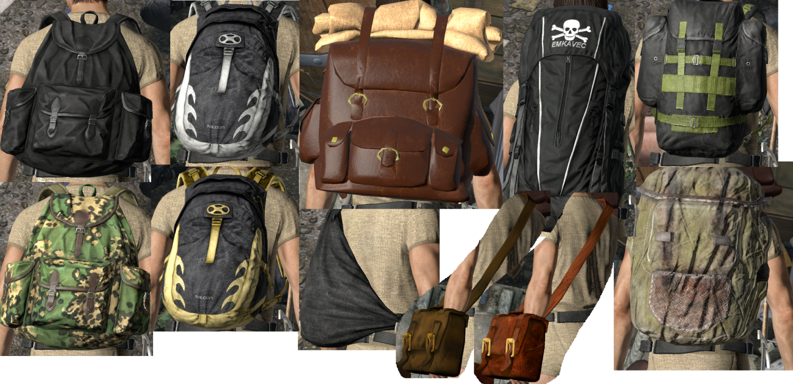

### Belts

Here are a few custom belts pulled from various sources. See the attributions below for who created the model.

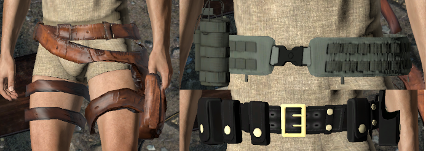

### Glasses

- Custom NVG
- Short Range NVG
- Quad NVG

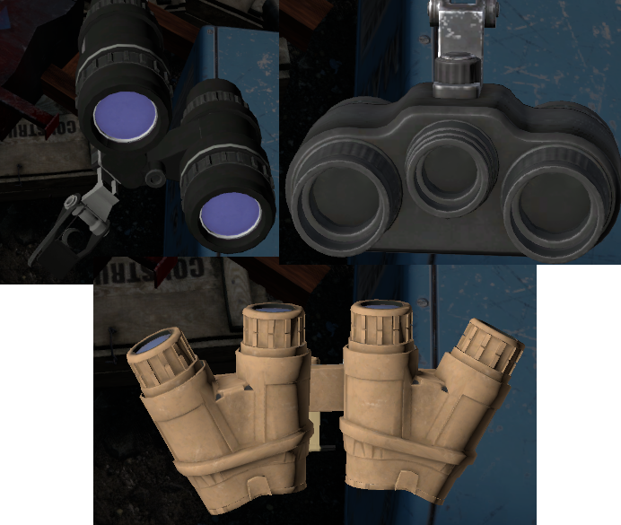

### Gloves

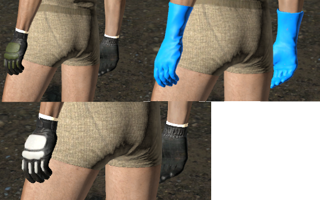

### Headgear

- MotoHelmets only partially obstruct your voice.
- Headtorch size is a 2x1.
- Tons of custom bandana's.

#### Retextures and New Items

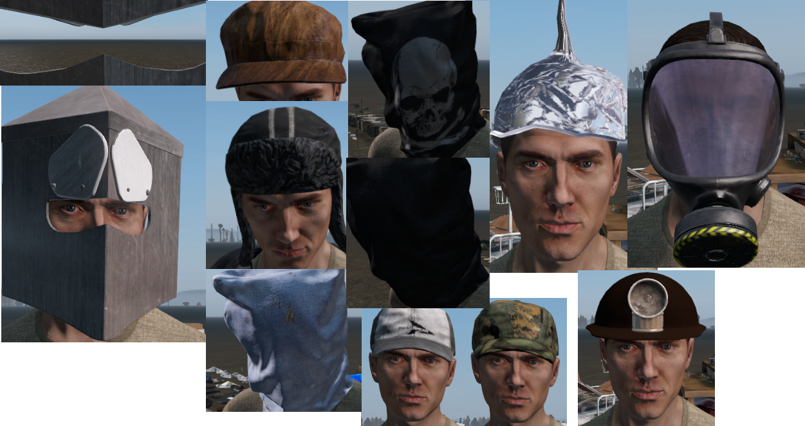

### Masks

- GasMask only partially obstruct your voice.
- Tons of custom bandana's.

#### Retextures and New Items

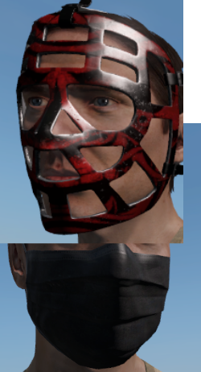

### Pants

#### Retextures and New Items

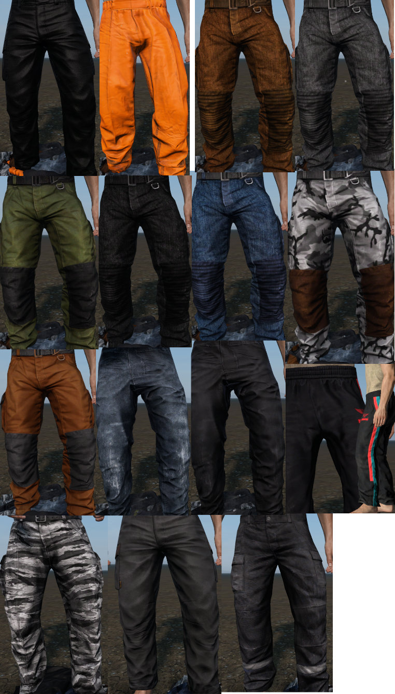

### Shoes

#### Retextures and New Items

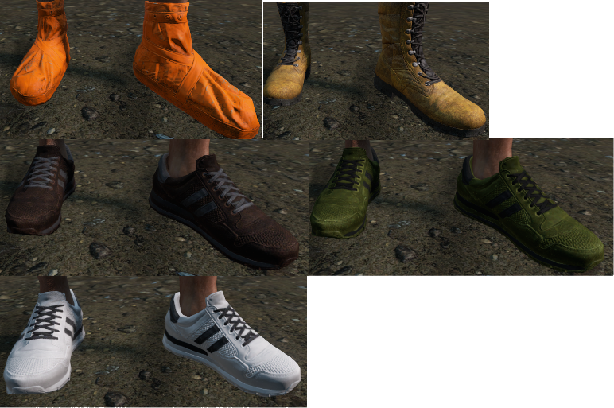

### Tops

#### Retextures and New Items

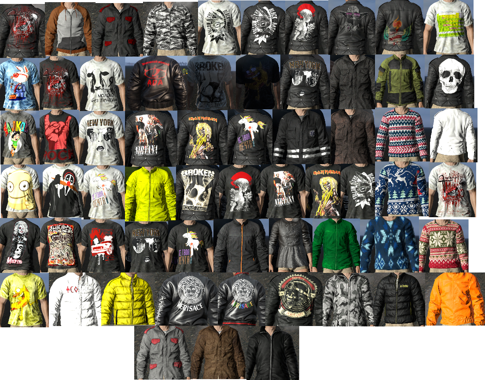

### Vests

#### Retextures and New Items

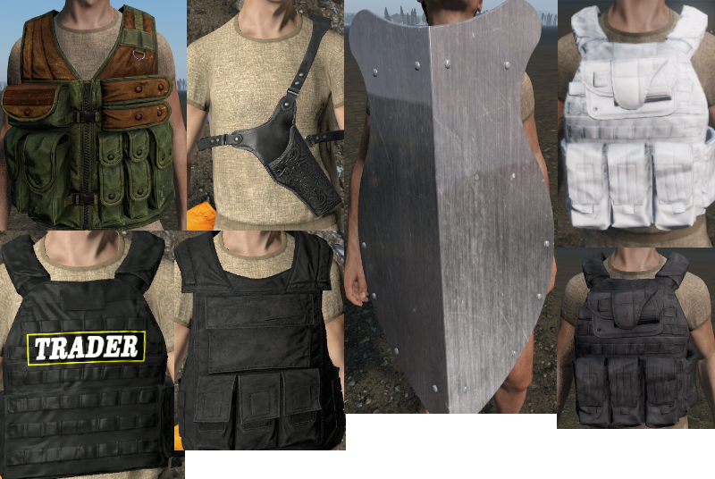

## Gear

### Camping

- Sleeping bags do not provide storage.
- Flagpoles are built with shovels.
- Cable Reels have 50 units of length.

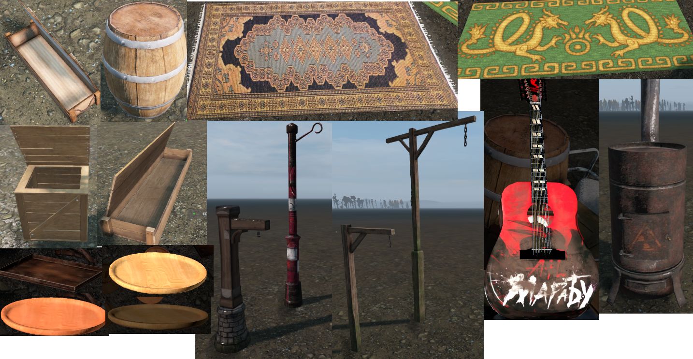

### Consumables

- Increased battery storage.
- Planks stack to 20.
- Turquoise, Red, Brown, Green Spraypaint cans.
- Refillable butane canister

### Containers

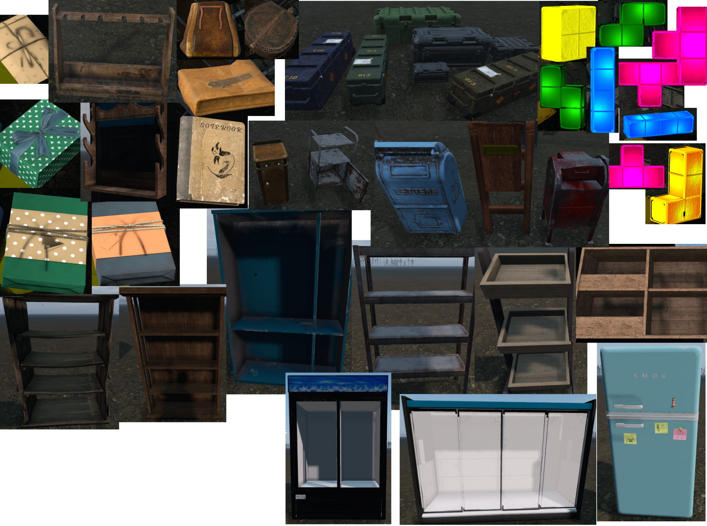

### Cooking

- The Portable Gas Lamp is equipable to certain slots.

### Crafting

- Advanced Workbench
  - Ammo Press
  - Caseing Prep
- Shooting Targets
- Combine heat packs.
- Refill butane canisters

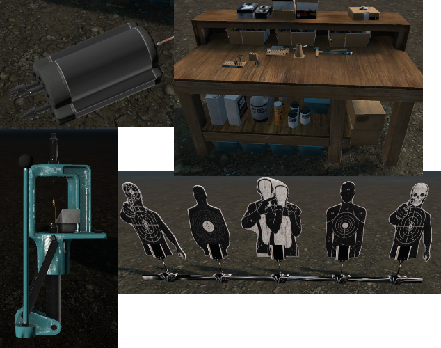

### Drinks

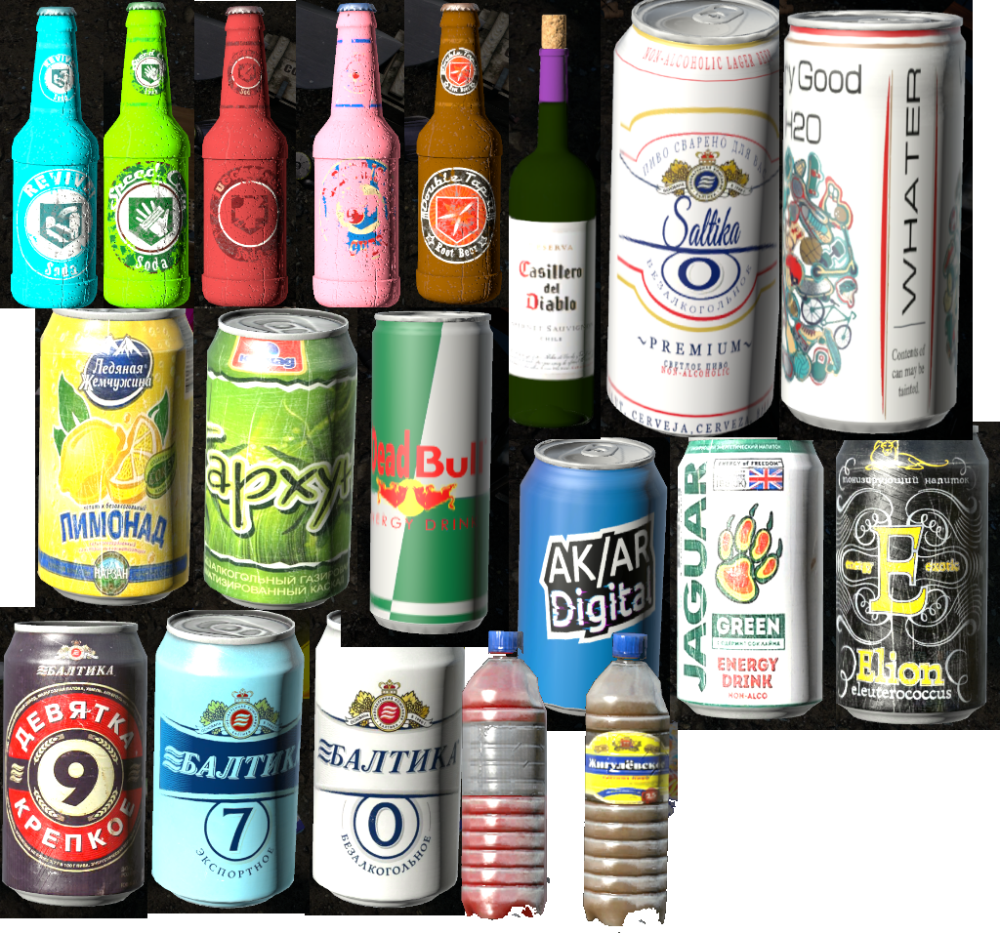

### Food

- Box cereal can be split and combined.
- Meat is an ingredient for many recipes and attaches to plates.
- Meat can be smoked and burns when above 60C for too long.
- Canning food is now an option in three forms: Veggie, Meat, Combo.

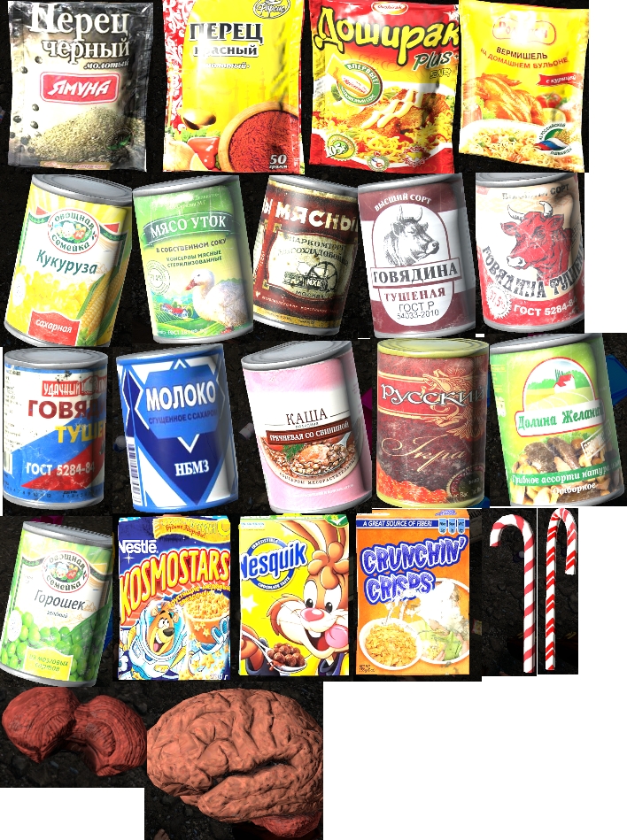

### Medical

- Expanded medical supplies.
- Bacteria/Virus/Antibiotic Injectors and Cures.

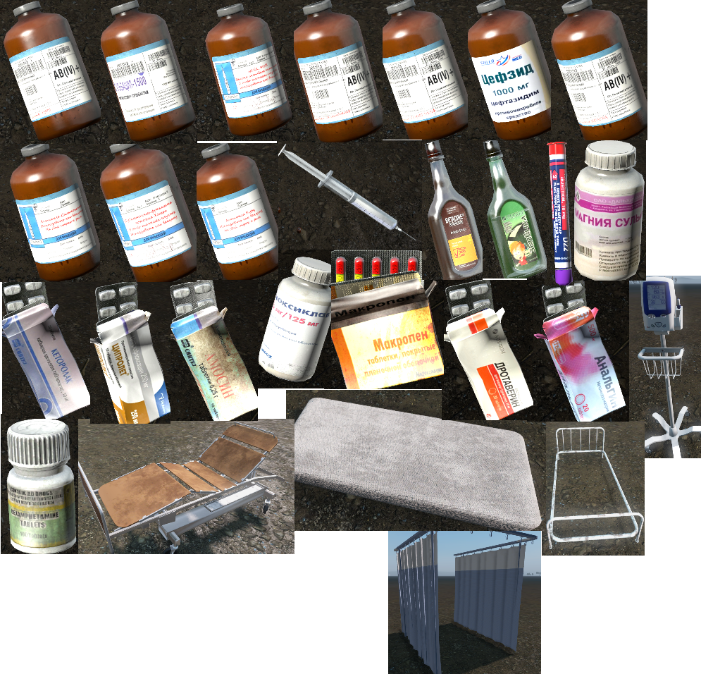

## Accessories

### Lab Tubes

5 colors of lab tubes that can be added to a Lab Tube Rack. Combine colors and try to discover the recipe's that exist for science!  
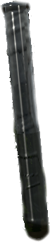
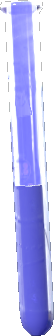
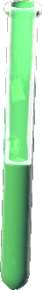
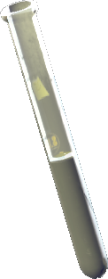
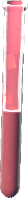

### Lab Tube Rack

A rack to hold lab tubes. This item is required for crafting at the Drug Workbench

### Meth Tub

A workbench for crafting drugs! There are many recipes and the first step is finding where they are written down but be careful... without the right combination of lab tubes, you might make something dangerous. >:3

`Attachments are disabled for now`

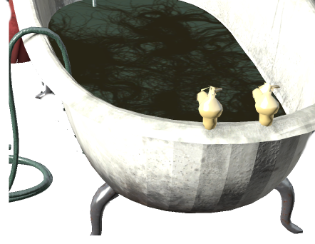

### Smoking Pipe

Look dapper with this high quality pipe. Light it with matches or zippo lighter but don't forget to put it out or you might start a fire!

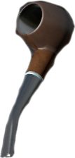

### Cigarette Case

Any classy citizen of the alpocalypse needs a place to store their narcotics. A cigarette case is the perfect blend of suave and class that says to the world "I have my shit together."

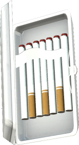

## Consumables

### Meth Crystals

Side effects include Laughing, Blurred Vision, Paranoia, Loss of color and an erratic feeling of accomplishment

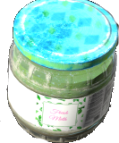

### Bath Salts

Side effects include Laughing, Blurred Vision, Paranoia and a terrible feeling on your stomach

### Acid

**Photosensitive Warning**

Side effects include Laughing, Coughing, Vomiting, Blurred Vision, Paranoia and the feeling that something bad might happen.

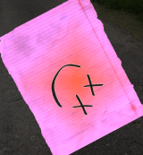
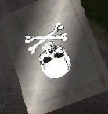

## Smokables

### ZWeed

Side effects include Laughing, Coughing, Blurred Vision, Dry Mouth and an overall feeling of euphoria. Light your joints with matches or a zippo.

### Cigarettes & Cigars

Side effects include Coughing, Blurred Vision, Dry Mouth and a slight focused feeling. Light your cigs with matches or a zippo.

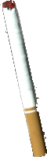
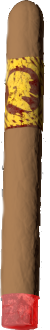

## Drug Packs

Ever felt like your pockets just can't hold enough drugs? Well look no further. Now you can make packs of cigarettes or joints and even make a carton to hold even more! Don't look like a chump. Make yours today!

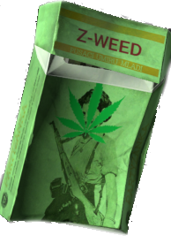
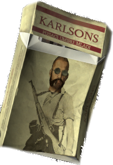

## Cartons

Sometimes a box of joints fails to meet the requirements of the highest of cultured individuals. This container will allow you to store so many smokable items that you might as well become a chimney.

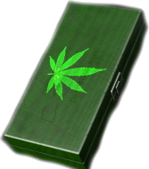
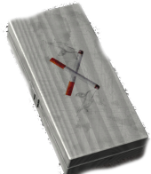
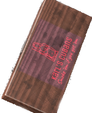

## Medical

### Naloxone

For those times when you go too far.

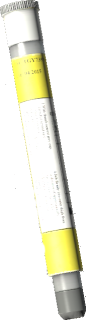

### Optics

- Binoculars can be equiped to slots

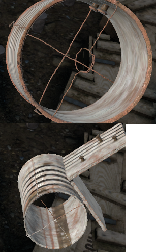

### Radio

- Cassette players can be attached to walkie talkie slots
  - There are many music, lore and recording tapes.
- Different ranges for radios to allow for tighter control on how far you can be heard.
  - 500m Red
  - 1km White, Yellow
  - 2.5km Green, Blue
  - 5km Handheld Radio (Black)
  - 7.5km Military Radio (Green)

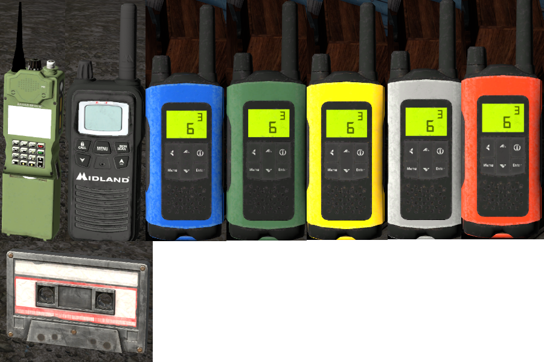

### Tools

- Heat packs last longer and get kinda hot.
- Field shovels can be equiped in certain slots.
- Hammer can be repaired with the right kit.
- Fire Extinguisher can be equiped in melee slot
- New heatpack that burns very hot
- Multi-color pens: Black, Blue, Red, Green

## HUD Changes

- "H" Hotkey to display the compass on your HUD.
- "`/~" Press to hid your hotbar. Hold to toggle hide your UI
- "O" Hotkey to mute your radio from broadcasting your voice. Useful for group radio discipline.

## Gameplay Changes

- Chance for a brain to drop from a cut up survivor.
- Unfold your map and run while orienteering.
- Inject your enemies with bioweapons and cure your allies.
- Placed Objects require a screwdriver or hammer to dismantle. This incidicates a hard raid which needs to be approved by the admins.

# SRP_Gestures

This mod adds a new emote category called **Custom** to the DayZ emote wheel. It adds several existing player animations into emotes.

## Emotes

- Cough
- Bullet Hit (1 Bleed and 250 Bloodloss)
- Bleed (1 Bleed)
- Blood Loss (500 Bloodloss)
- Sneeze
- Laugh
- Unconscious (30 seconds of unconscious)
- Shiver
- Sweat
- Break Leg (breaks your leg)

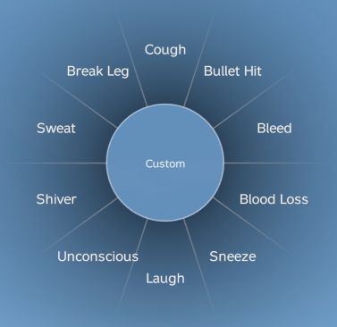

## Sleeping

Lying down now causes the screen to go dark as your eye close.

## Player Agents

### Sleep

Sleep is required by all humans, luckily you are stronger than most. Sleep 10 minutes for every 4 hours... the true uberman. If you do not sleep you will pass out.

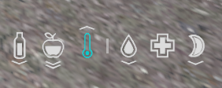

### BioHazard

BioHazard zone is now in overdrive. Approach at your own risk with or without protection. Mild symptoms include dry mouth, upset stomach, splitting of skin, bleeding from all orifices, and eventually death. Most of these symptoms can be mitigate by protection. Find your local biological arms dealer to learn more.

## Recipes

- 1 Large Meth Jar -> 2 Medium Jars
- 1 Medium Meth Jar -> 2 Small Jars
- Cook Meth
- Cook Bath Salts
- Synthesize Acid
- Weed and Paper -> Roll Joint
- Weed and container -> Joint Pack
- Cigarette and container -> Cigarette Pack
- Cigar and container -> Cigar Box
- Joint Pack and container -> Joint Carton
- Cigarette Pack and container -> Cigarette Carton
- Smokable + flammable -> Lit Smokable
- Dynamite|Roadflare and tools -> Gunpowder
- Grenade|Landmine and tools -> Gunpowder (Chance to explode but high yield)

## Modifiers

- Alcohol (Coming soon)
- Bath Salts
- BioHazard
- Meth
- Tiredness
- Acid (Smile)
- Acid (Skull)
- Stoned
- Tobacco

## Unlimited Stamina

You wanted to run forever so now you can. Don't stop your you will drop!

## Structures

### Furniture

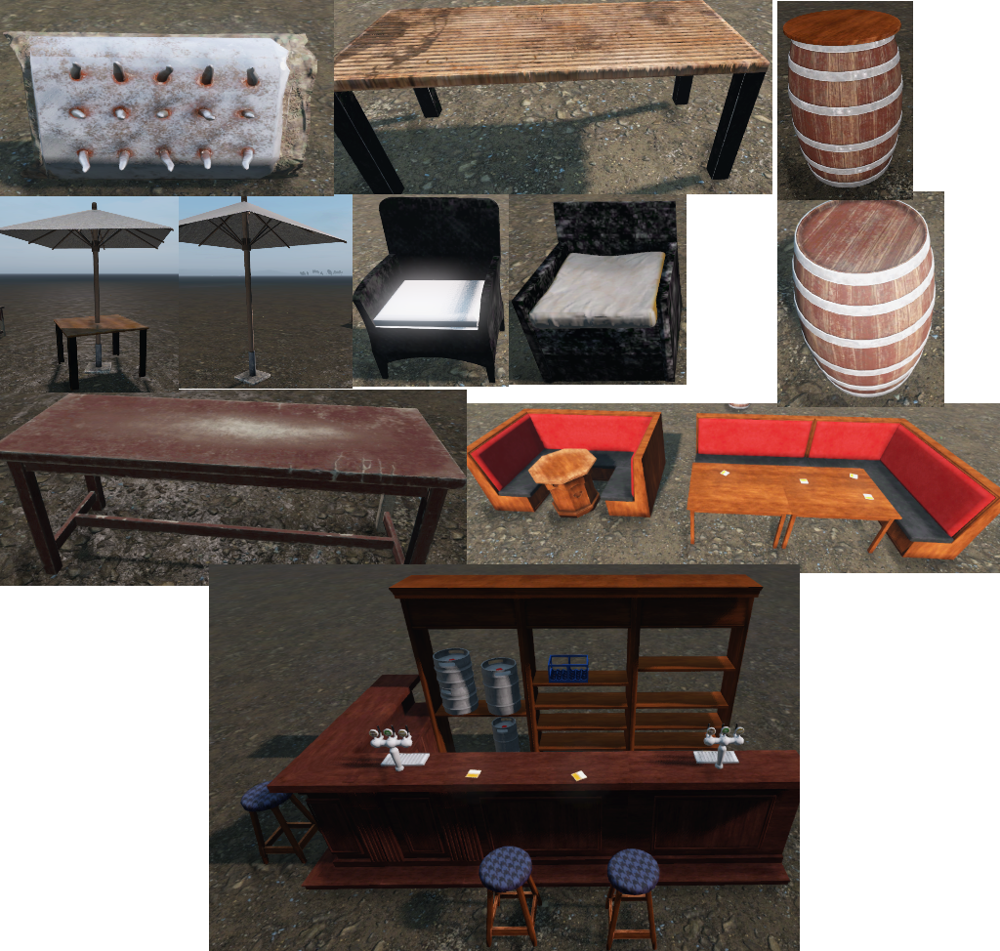

### Signs

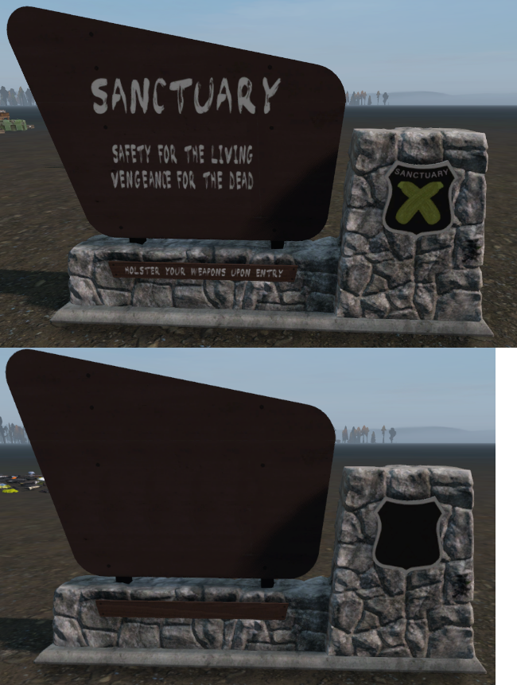

### Vehicles

- Jerry cans are smaller, hold more and sound different.

## Ammunition

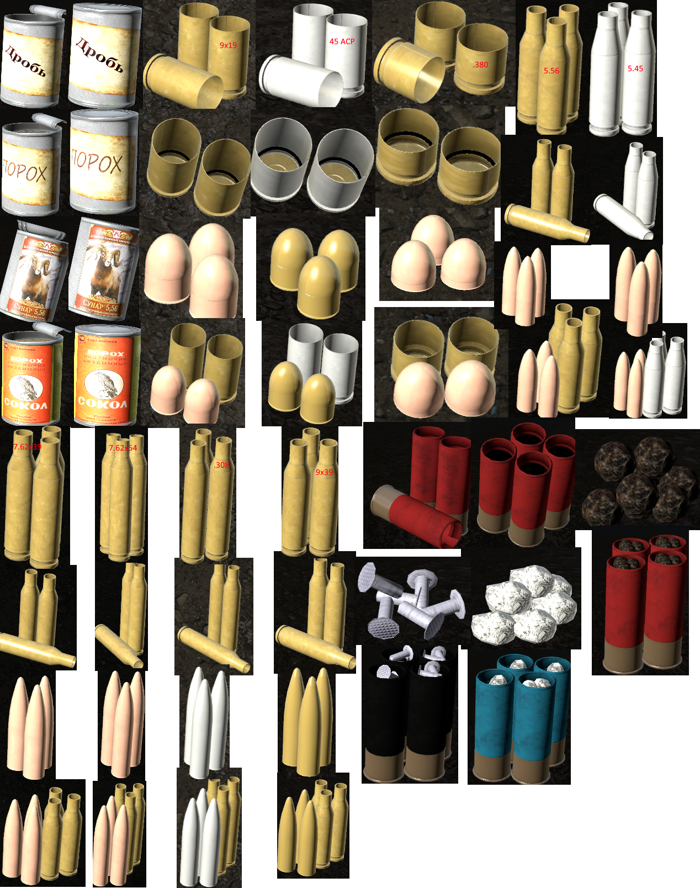

# Attributions

DaddyPrapor - Original Creator of Modular Vest System (MVS) Mod. https://github.com/WCSarris/modular-vest-system. Given express consent for repacking and modifying.

"potbelly stove" (https://skfb.ly/68UNF) by Yksnawel is licensed under Creative Commons Attribution-NonCommercial (http://creativecommons.org/licenses/by-nc/4.0/).

"Wooden plate" (https://skfb.ly/6RH9Q) by quedlin is licensed under Creative Commons Attribution (http://creativecommons.org/licenses/by/4.0/).

"Wooden plate" (https://skfb.ly/6WSWT) by 乾元恒 is licensed under Creative Commons Attribution (http://creativecommons.org/licenses/by/4.0/).

"Old Guitar Acoustic "Custom" Gibson Hummingbird" (https://skfb.ly/6XSyw) by Maxim Lukyanov is licensed under Creative Commons Attribution (http://creativecommons.org/licenses/by/4.0/).

"Lamp Post w/ Handpainted Textures" (https://skfb.ly/CVJU) by Christian Lüdeking is licensed under Creative Commons Attribution (http://creativecommons.org/licenses/by/4.0/).

"Lamp post" (https://skfb.ly/6WMoU) by YouSaveTime is licensed under Creative Commons Attribution (http://creativecommons.org/licenses/by/4.0/).

"TeaScroll Clubhouse - Rug Prop" (https://skfb.ly/6D89H) by Anaïs Faure is licensed under Creative Commons Attribution (http://creativecommons.org/licenses/by/4.0/).

"Persian Rug" (https://skfb.ly/KWsy) by Nicholas Record is licensed under Creative Commons Attribution (http://creativecommons.org/licenses/by/4.0/).

"wooden box #5" (https://skfb.ly/6WTZ9) by DZs is licensed under Creative Commons Attribution (http://creativecommons.org/licenses/by/4.0/).

"Military wooden crate" (https://skfb.ly/6XNyB) by DZs is licensed under Creative Commons Attribution (http://creativecommons.org/licenses/by/4.0/).

"Wooden barrel and box" (https://skfb.ly/6Z78B) by teinaaVa is licensed under Creative Commons Attribution (http://creativecommons.org/licenses/by/4.0/).

"Backpack(mid-poly and subdivision)" (https://skfb.ly/6UtR7) by andree is licensed under Creative Commons Attribution (http://creativecommons.org/licenses/by/4.0/).

"Survival Backpack" (https://skfb.ly/6WBpu) by Thunder is licensed under Creative Commons Attribution-ShareAlike (http://creativecommons.org/licenses/by-sa/4.0/).

"Old small leather pouch" (https://skfb.ly/6XoEQ) by workwalker is licensed under Creative Commons Attribution (http://creativecommons.org/licenses/by/4.0/).

"medieval bag" (https://skfb.ly/6RKAE) by Cyril43 is licensed under Creative Commons Attribution (http://creativecommons.org/licenses/by/4.0/).

"Leather Pouch" (https://skfb.ly/6pJ6C) by FlukierJupiter is licensed under Creative Commons Attribution (http://creativecommons.org/licenses/by/4.0/).

"Victorian Bedside Table" (https://skfb.ly/6WMSW) by Jamie McFarlane is licensed under Creative Commons Attribution (http://creativecommons.org/licenses/by/4.0/).

"Bedside Table" (https://skfb.ly/YYPR) by HASSAN is licensed under Creative Commons Attribution (http://creativecommons.org/licenses/by/4.0/).

"Satchel" (https://skfb.ly/6DoRr) by BillieBones is licensed under Creative Commons Attribution (http://creativecommons.org/licenses/by/4.0/).

"Apocalypse: Geared Survivor [Female]" (https://skfb.ly/6RWoC) by CatBYTE Studio is licensed under Creative Commons Attribution-NonCommercial (http://creativecommons.org/licenses/by-nc/4.0/).

"Police Belt" (https://skfb.ly/6U7p7) by supervigy is licensed under Creative Commons Attribution (http://creativecommons.org/licenses/by/4.0/).

"Tactical Belt "Falcon B1"" (https://skfb.ly/6WEBS) by Mayess is licensed under Creative Commons Attribution (http://creativecommons.org/licenses/by/4.0/).

"Tinfoil Hat" (https://skfb.ly/6yMWN) by tamzidfarhan is licensed under Creative Commons Attribution-ShareAlike (http://creativecommons.org/licenses/by-sa/4.0/).

"Miners helmet with carbide lamp" (https://skfb.ly/6VoLK) by Shannen Art is licensed under Creative Commons Attribution (http://creativecommons.org/licenses/by/4.0/).

"PPM-88 Gas mask" (https://skfb.ly/6SFoC) by J\_ is licensed under Creative Commons Attribution (http://creativecommons.org/licenses/by/4.0/).

"Brewster Body Shield" (https://skfb.ly/6sBtH) by UC San Diego - Digital Media Lab is licensed under Creative Commons Attribution (http://creativecommons.org/licenses/by/4.0/).

"Walkie-Talkie" (https://skfb.ly/o6pAQ) by ludwigbey is licensed under Creative Commons Attribution (http://creativecommons.org/licenses/by/4.0/).

"Bed" (https://skfb.ly/6UyKU) by Tolu is licensed under Creative Commons Attribution (http://creativecommons.org/licenses/by/4.0/).

"Stretcher" (https://skfb.ly/ono7t) by Odlab is licensed under Creative Commons Attribution (http://creativecommons.org/licenses/by/4.0/).

"Gourney - Hospital Bed" (https://skfb.ly/o6TPV) by meeww is licensed under Creative Commons Attribution (http://creativecommons.org/licenses/by/4.0/).

"Bed Curtain and Vital Signs Monitor" (https://skfb.ly/6SCRx) by Ethan Cragun is licensed under Creative Commons Attribution (http://creativecommons.org/licenses/by/4.0/).

"Brain" (https://skfb.ly/6SnKS) by spliter is licensed under Creative Commons Attribution (http://creativecommons.org/licenses/by/4.0/).

"Simple Candy Canes" (https://skfb.ly/6GNBO) by Blender3D is licensed under Creative Commons Attribution (http://creativecommons.org/licenses/by/4.0/).

"Candy Treasure Chest" (https://skfb.ly/6S7Zu) by Jay Topham is licensed under Creative Commons Attribution (http://creativecommons.org/licenses/by/4.0/).

"Cans" (https://skfb.ly/6Xrvt) by tonygrinayde\_ is licensed under Creative Commons Attribution (http://creativecommons.org/licenses/by/4.0/).

"Wine Objects" (https://skfb.ly/6SqRQ) by Paul is licensed under Creative Commons Attribution (http://creativecommons.org/licenses/by/4.0/).

"CoD Zombies Sodas" (https://skfb.ly/6VRIq) by albertjuli is licensed under Creative Commons Attribution (http://creativecommons.org/licenses/by/4.0/).

"Post Apocalyptic Mailbox" (https://skfb.ly/6WZL7) by Marcin Klosowski is licensed under Creative Commons Attribution (http://creativecommons.org/licenses/by/4.0/).

"Mailbox" (https://skfb.ly/6wPWT) by Ronald Hessens is licensed under Creative Commons Attribution (http://creativecommons.org/licenses/by/4.0/).

"Mailbox Homework" (https://skfb.ly/6RWZr) by Andy Shishkin is licensed under Creative Commons Attribution (http://creativecommons.org/licenses/by/4.0/).

"Military case" (https://skfb.ly/6BNt8) by diaspora is licensed under Creative Commons Attribution (http://creativecommons.org/licenses/by/4.0/).

"Military Container Free" (https://skfb.ly/ooHST) by Epic_Hard_RU is licensed under Creative Commons Attribution (http://creativecommons.org/licenses/by/4.0/).

"Military Ammunition Case" (https://skfb.ly/VESS) by Yoni Van Gucht is licensed under Creative Commons Attribution (http://creativecommons.org/licenses/by/4.0/).

"Military Case" (https://skfb.ly/o6tuM) by KobieCaestecker is licensed under Creative Commons Attribution (http://creativecommons.org/licenses/by/4.0/).

"Merchandiser Refrigerator" (https://skfb.ly/ono6B) by Sapwood Studio is licensed under Creative Commons Attribution-ShareAlike (http://creativecommons.org/licenses/by-sa/4.0/).

"Food shop showcase" (https://skfb.ly/6UHZU) by bretzel44 is licensed under Creative Commons Attribution (http://creativecommons.org/licenses/by/4.0/).

"Weapon Rack" (https://skfb.ly/6WYxB) by Big2XG is licensed under Creative Commons Attribution (http://creativecommons.org/licenses/by/4.0/).

"Weapon Rack" (https://skfb.ly/6U7NX) by BlueHorizon is licensed under Creative Commons Attribution (http://creativecommons.org/licenses/by/4.0/).

"Simple Wall Shelf" (https://skfb.ly/6COuP) by Blender3D is licensed under Creative Commons Attribution (http://creativecommons.org/licenses/by/4.0/).

"Retro Fridge" (https://skfb.ly/6RWwu) by Zlat is licensed under Creative Commons Attribution-NonCommercial (http://creativecommons.org/licenses/by-nc/4.0/).

"Very Simplified Shelf" (https://skfb.ly/6CUz6) by Blender3D is licensed under Creative Commons Attribution (http://creativecommons.org/licenses/by/4.0/).

"Rusted metal shelf" (https://skfb.ly/6U7QS) by ELIZION is licensed under Creative Commons Attribution (http://creativecommons.org/licenses/by/4.0/).

"Bullets" (https://skfb.ly/6AUrR) by MarcosBritoJR is licensed under Creative Commons Attribution (http://creativecommons.org/licenses/by/4.0/).

"WIP/ Smoky Quartz crystal - crushed" (https://skfb.ly/6WQVX) by laboratorija is licensed under CC Attribution-NonCommercial-ShareAlike (http://creativecommons.org/licenses/by-nc-sa/4.0/).

"Nails" (https://skfb.ly/6qOUp) by Alex Bes is licensed under Creative Commons Attribution (http://creativecommons.org/licenses/by/4.0/).

"First try" (https://skfb.ly/6YGOP) by Annie Yoon is licensed under Creative Commons Attribution (http://creativecommons.org/licenses/by/4.0/).

"Shelf" (https://skfb.ly/6WOFz) by Virtareal.Asia is licensed under Creative Commons Attribution (http://creativecommons.org/licenses/by/4.0/).

"Tall Wooden Medieval Shelf" (https://skfb.ly/6WSuJ) by Oliver Triplett is licensed under Creative Commons Attribution (http://creativecommons.org/licenses/by/4.0/).

"Shelf" (https://skfb.ly/6BByU) by Bailey Lawler is licensed under Creative Commons Attribution (http://creativecommons.org/licenses/by/4.0/).

"Tetris Shelf" (https://skfb.ly/o6w8R) by BlackCube is licensed under Creative Commons Attribution (http://creativecommons.org/licenses/by/4.0/).

"Presents" (https://skfb.ly/6FEMv) by cranberrymk is licensed under Creative Commons Attribution (http://creativecommons.org/licenses/by/4.0/).

"Nail Shoulder Patch" (https://skfb.ly/6VK6Z) by Thunder is licensed under Creative Commons Attribution-ShareAlike (http://creativecommons.org/licenses/by-sa/4.0/).

"Bullet Pack" (https://skfb.ly/6WMBY) by paoone28 is licensed under Creative Commons Attribution (http://creativecommons.org/licenses/by/4.0/).

"Logs" (https://skfb.ly/P8SY) by TrolliZBS is licensed under Creative Commons Attribution (http://creativecommons.org/licenses/by/4.0/).

"Yankee 1545 Hand Drill" (https://skfb.ly/6RrOH) by lukasmaly is licensed under Creative Commons Attribution (http://creativecommons.org/licenses/by/4.0/).

"18th Century Hand Drill" (https://skfb.ly/6XSDt) by Rob.Caenen is licensed under Creative Commons Attribution (http://creativecommons.org/licenses/by/4.0/).

"Glue Pliers" (https://skfb.ly/6X97P) by JarnoVR is licensed under Creative Commons Attribution (http://creativecommons.org/licenses/by/4.0/).

"lathe" (https://skfb.ly/6XJP6) by Oleg is licensed under Creative Commons Attribution (http://creativecommons.org/licenses/by/4.0/).

"Neon Letters" (https://skfb.ly/6wPxw) by danny_p3d is licensed under Creative Commons Attribution (http://creativecommons.org/licenses/by/4.0/).

"Calipers" (https://skfb.ly/6uXOX) by T-FLEX CAD ST (Free) is licensed under Creative Commons Attribution (http://creativecommons.org/licenses/by/4.0/).

"Low-poly Ammonition set" (https://skfb.ly/op6DM) by NexysStormcloud is licensed under Creative Commons Attribution (http://creativecommons.org/licenses/by/4.0/).

"Gravestones COLLECTION" (https://www.cgtrader.com/3d-model-collections/gravestones-collection-21bd4504-dbbc-4aff-aab6-a9a4835e36b8) by ArtLeaving is licensed under Royalty Free (https://www.cgtrader.com/pages/terms-and-conditions#royalty-free-license)

"Dice" (https://skfb.ly/op6CD) by elextraza is licensed under Creative Commons Attribution (http://creativecommons.org/licenses/by/4.0/).

"Free Palisade logs" (https://skfb.ly/o6AEP) by Joan LP is licensed under Creative Commons Attribution (http://creativecommons.org/licenses/by/4.0/).

"Toolbox" (https://skfb.ly/JIC8) by beyondmatter is licensed under Creative Commons Attribution (http://creativecommons.org/licenses/by/4.0/).

"Old Russian house" (https://skfb.ly/6QVCC) by Yury Misiyuk is licensed under Creative Commons Attribution (http://creativecommons.org/licenses/by/4.0/).

"Old Russian house" (https://skfb.ly/6QSsZ) by Yury Misiyuk is licensed under Creative Commons Attribution (http://creativecommons.org/licenses/by/4.0/).

"Wooden house" (https://skfb.ly/6TSPA) by PamPo is licensed under Creative Commons Attribution (http://creativecommons.org/licenses/by/4.0/).

"Rural Toilet" (https://skfb.ly/6QYJ9) by shedmon is licensed under Creative Commons Attribution (http://creativecommons.org/licenses/by/4.0/).

"Farm Cow Barn" (https://skfb.ly/6pqJZ) by BytesCrafter is licensed under Creative Commons Attribution (http://creativecommons.org/licenses/by/4.0/).

"Low | Farm | Assembly | Dirty | House | Poor" (https://skfb.ly/o6qpC) by Erroratten is licensed under Creative Commons Attribution (http://creativecommons.org/licenses/by/4.0/).

"Glasses" (https://skfb.ly/6WMUM) by _SeF_ is licensed under Creative Commons Attribution (http://creativecommons.org/licenses/by/4.0/).

- "Abandoned Drugslab Indoor" (https://skfb.ly/6yzC8) by seenoise is licensed under Creative Commons Attribution (http://creativecommons.org/licenses/by/4.0/).

- "3rd - Chemistry // Old Lab Tubes" (https://skfb.ly/6WTvJ) by Ringo Gunther is licensed under Creative Commons Attribution (http://creativecommons.org/licenses/by/4.0/).

- "Cigar" (https://skfb.ly/6t9Oy) by Escoly is licensed under Creative Commons Attribution (http://creativecommons.org/licenses/by/4.0/).

- "Cigarette case" (https://skfb.ly/6QXGW) by AgitoDi is licensed under Creative Commons Attribution (http://creativecommons.org/licenses/by/4.0/).

- "Cigarette - daily3D" (https://skfb.ly/6XnvD) by RomanMaksy is licensed under Creative Commons Attribution (http://creativecommons.org/licenses/by/4.0/).

- "Smoking Pipe" (https://skfb.ly/NKYo) by beyondmatter is licensed under Creative Commons Attribution (http://creativecommons.org/licenses/by/4.0/).

- "Dynamite stick" (https://skfb.ly/6z8uT) by BÖMSTRÖM is licensed under Creative Commons Attribution (http://creativecommons.org/licenses/by/4.0/).

- "TNT Sack" (https://skfb.ly/6WOGJ) by Warkarma is licensed under Creative Commons Attribution (http://creativecommons.org/licenses/by/4.0/).

- "Civil Defense Geiger-Counter" (https://skfb.ly/6WMpz) by Steven Janes is licensed under Creative Commons Attribution (http://creativecommons.org/licenses/by/4.0/).

- "Lab Things" (https://skfb.ly/6TZRu) by Renafox is licensed under Creative Commons Attribution (http://creativecommons.org/licenses/by/4.0/).

- "Katana and bamboo sword" (https://skfb.ly/6U9Rw) by Sybren Westendorp is licensed under Creative Commons Attribution (http://creativecommons.org/licenses/by/4.0/).

- "Simple Toilet Paper" (https://skfb.ly/6zHO8) by Blender3D is licensed under Creative Commons Attribution (http://creativecommons.org/licenses/by/4.0/).

- "Natural Paper box - King Size" (https://skfb.ly/6WCEq) by LaSemillaAutomatica is licensed under CC Attribution-NonCommercial-NoDerivs (http://creativecommons.org/licenses/by-nc-nd/4.0/). (Not monetized or modified)

- "Neon Letters" (https://skfb.ly/6wPxw) by danny_p3d is licensed under Creative Commons Attribution (http://creativecommons.org/licenses/by/4.0/).

- "Green Shrub" (https://skfb.ly/6GHDq) by Somersby is licensed under Creative Commons Attribution-NonCommercial (http://creativecommons.org/licenses/by-nc/4.0/).

- "Brick" (https://skfb.ly/67znx) by martn00 is licensed under Creative Commons Attribution (http://creativecommons.org/licenses/by/4.0/).

- "Flourbag" (https://skfb.ly/6XvrX) by Thunder is licensed under Creative Commons Attribution-ShareAlike (http://creativecommons.org/licenses/by-sa/4.0/).

- "Name Plate" (https://skfb.ly/6R8Kv) by Andrew.Mischenko is licensed under Creative Commons Attribution (http://creativecommons.org/licenses/by/4.0/).

- "Glasses" (https://skfb.ly/6WMUM) by _SeF_ is liceWnsed under Creative Commons Attribution (http://creativecommons.org/licenses/by/4.0/).

- "Mińsk" Fridge" (https://skfb.ly/6BME7) by Michalina "Miszla" Gąsienica-Laskowy is licensed under CC Attribution-NonCommercial-ShareAlike (http://creativecommons.org/licenses/by-nc-sa/4.0/).

- "Lowpoly Rocks - 3" (https://skfb.ly/6yTQs) by Loïc Norgeot is licensed under Creative Commons Attribution (http://creativecommons.org/licenses/by/4.0/).

- "Crystal Pack Stylized" (https://skfb.ly/6URYJ) by Batuhan13 is licensed under Creative Commons Attribution (http://creativecommons.org/licenses/by/4.0/).

- "Chaos Emerald" (https://skfb.ly/YJ6W) by Kelsey113 is licensed under Creative Commons Attribution (http://creativecommons.org/licenses/by/4.0/).

- "Tools" (https://skfb.ly/6wEpC) by Caboose3d is licensed under Creative Commons Attribution (http://creativecommons.org/licenses/by/4.0/).

- "Forge" (https://skfb.ly/6RDvU) by Thunder is licensed under Creative Commons Attribution-ShareAlike (http://creativecommons.org/licenses/by-sa/4.0/).

- "Crucible Tongs - Game Ready" (https://skfb.ly/onvnO) by re1monsen is licensed under Creative Commons Attribution (http://creativecommons.org/licenses/by/4.0/).

- "Clay Bar Mold" (https://skfb.ly/6C9BL) by Ceramic Technology Lab is licensed under CC Attribution-NonCommercial-NoDerivs (http://creativecommons.org/licenses/by-nc-nd/4.0/).

- "Gold Ingot" (https://skfb.ly/o69UQ) by Matthew_Games is licensed under Creative Commons Attribution (http://creativecommons.org/licenses/by/4.0/).

- "Fantasy Designed Coins - (Gold, Silver, Copper)" (https://skfb.ly/6TtQu) by Kigha is licensed under Creative Commons Attribution (http://creativecommons.org/licenses/by/4.0/).

- "Portal" (https://skfb.ly/6vZK6) by DJMaesen is licensed under Creative Commons Attribution (http://creativecommons.org/licenses/by/4.0/).

- "Bone Portal" (https://skfb.ly/6xBRC) by Gabrieltim3D is licensed under Creative Commons Attribution (http://creativecommons.org/licenses/by/4.0/).

- "Portal Frame" (https://skfb.ly/6CxTF) by soidev is licensed under Creative Commons Attribution (http://creativecommons.org/licenses/by/4.0/).

- "Street Light" (https://skfb.ly/T86Z) by KloWorks is licensed under Creative Commons Attribution (http://creativecommons.org/licenses/by/4.0/).

- "Beacon" (https://skfb.ly/LwRU) by Mike Rowley is licensed under Creative Commons Attribution-NonCommercial (http://creativecommons.org/licenses/by-nc/4.0/).

- "Fire beacon" (https://skfb.ly/6VWxC) by Ivan Norman is licensed under Creative Commons Attribution (http://creativecommons.org/licenses/by/4.0/).

- "Wastelands Building Materials Kit1" (https://skfb.ly/6USMs) by Thunder is licensed under Creative Commons Attribution-ShareAlike (http://creativecommons.org/licenses/by-sa/4.0/).

- "Karambit" by Nohiro (https://sketchfab.com/3d-models/karambit-b0789f7e29e54f7183718d68cdfbe836) (Purchased)

- "Cooked Turkey Beanie" by Tiyshen (https://sketchfab.com/3d-models/cooked-turkey-beanie-65099b3c982841e9982dab52b105d8ff) (Purchased)

- "Sacrifice Table" (https://skfb.ly/6SZXH) by DivyeSh PanchAl is licensed under Creative Commons Attribution (http://creativecommons.org/licenses/by/4.0/).

- "Сrystal" (https://skfb.ly/6WORM) by pronko.tata is licensed under Creative Commons Attribution (http://creativecommons.org/licenses/by/4.0/).

- "Fantasy Light Plant" (https://skfb.ly/6WMwF) by artikora is licensed under Creative Commons Attribution (http://creativecommons.org/licenses/by/4.0/).

- "Demon Skull" (https://skfb.ly/CBE9) by erikleiram is licensed under Creative Commons Attribution (http://creativecommons.org/licenses/by/4.0/).

- "Sacrificial Altar" (https://skfb.ly/OzxR) by Jochon is licensed under Creative Commons Attribution (http://creativecommons.org/licenses/by/4.0/).

- "Hannya mask skull" (https://skfb.ly/onnHY) by Doink is licensed under Creative Commons Attribution (http://creativecommons.org/licenses/by/4.0/).

- "Skull Mask" (https://skfb.ly/6zYOK) by T-Art is licensed under Creative Commons Attribution (http://creativecommons.org/licenses/by/4.0/).

- "Skull of goblin" (https://skfb.ly/6xRXF) by lostsoundzz is licensed under Creative Commons Attribution (http://creativecommons.org/licenses/by/4.0/).

- "Dragon Slayer \[Berserk\]" (https://skfb.ly/6RzGS) by G.Salmon is licensed under Creative Commons Attribution (http://creativecommons.org/licenses/by/4.0/).

- "Mace" (https://skfb.ly/6RPGq) by Cyril43 is licensed under Creative Commons Attribution (http://creativecommons.org/licenses/by/4.0/).

- "Computer SGD 116 - Logan Thomas" (https://skfb.ly/onO6p) by Logan Thomas is licensed under Creative Commons Attribution (http://creativecommons.org/licenses/by/4.0/).

- "Wooden Barricades" (https://skfb.ly/6wz9T) by ANRUVAL_3D_MODELS is licensed under Creative Commons Attribution (http://creativecommons.org/licenses/by/4.0/).

- "Wooden Barricade Blood" (https://skfb.ly/6X9zJ) by KobieCaestecker is licensed under Creative Commons Attribution (http://creativecommons.org/licenses/by/4.0/).

- "Forge And Bellow" (https://skfb.ly/6ZvWF) by RBG_illustrations is licensed under Creative Commons Attribution (http://creativecommons.org/licenses/by/4.0/).

- "Sign package" (https://skfb.ly/6rRZG) by Pedram Ashoori is licensed under Creative Commons Attribution (http://creativecommons.org/licenses/by/4.0/).

- "War Cleaver" (https://sketchfab.com/3d-models/war-cleaver-98894544fedb44fcbd3eff4914e27c7b) by Jack Bronswijk is licensed under Editorial (https://help.sketchfab.com/hc/en-us/articles/115004276346-Licenses#editorial).

- "The Broken Forge" () by Stéphane is licensed under Creative Commons Attribution (http://creativecommons.org/licenses/by/4.0/).

- "Computer #2" (https://skfb.ly/6DnxN) by sudreyskr is licensed under Creative Commons Attribution (http://creativecommons.org/licenses/by/4.0/).

- "Computer #4" (https://skfb.ly/6DnyH) by sudreyskr is licensed under Creative Commons Attribution (http://creativecommons.org/licenses/by/4.0/).

- "Rusty shelf" (https://skfb.ly/6WZCI) by GlowLow is licensed under Creative Commons Attribution (http://creativecommons.org/licenses/by/4.0/).

- "Rusty Metal Paint Bucket" (https://skfb.ly/o6wSp) by Rodion Perovsky is licensed under Creative Commons Attribution (http://creativecommons.org/licenses/by/4.0/).

- "FREE Lowpoly Barrels Set" (https://skfb.ly/6WTPQ) by Gamefruit is licensed under Creative Commons Attribution (http://creativecommons.org/licenses/by/4.0/).

- "Wooden Bed" (https://skfb.ly/XYPR) by toAflame is licensed under Creative Commons Attribution (http://creativecommons.org/licenses/by/4.0/).

- "Couch - midcentury modern" (https://skfb.ly/6CoC6) by MozillaHubs is licensed under Creative Commons Attribution (http://creativecommons.org/licenses/by/4.0/).

- "Old Couch" (https://skfb.ly/6RJEA) by Oliver Triplett is licensed under Creative Commons Attribution (http://creativecommons.org/licenses/by/4.0/).

# Wishlist

# Reference

- https://community.bistudio.com/wiki/DayZ_Contaminated_Areas_Configuration
