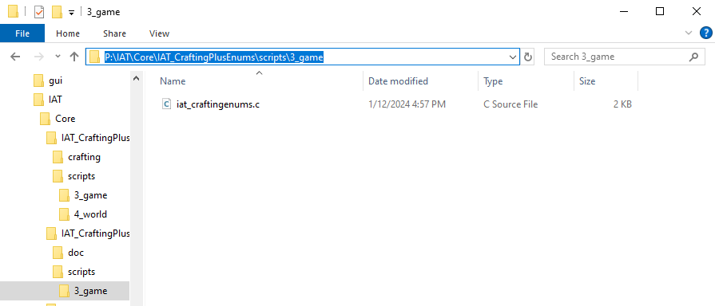
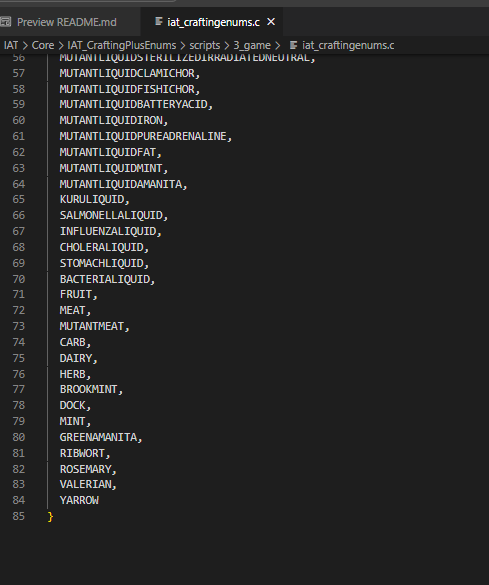
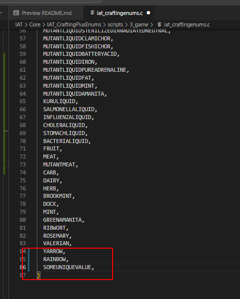
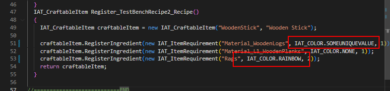

# Crafting Plus Enums

This `Addon` contains the enums necessary for customizing variants in the `Crafting Plus Addon`. It is meant to be repacked with custom values that relate to a specific servers crafting recipes.

# What are the enums for?

The enums in this mod provide a `static` immutable list of values that are used to delineate variants of the same items (colorbase). It removes the potential of typos in recipe creation however introduces a small overhead of having to repack the enum list. I feel the trade off of no typos to be worth the extra complexity.

# How do I make this mod useful?

In the file `P:\IAT\Core\IAT_CraftingPlusEnums\scripts\3_game\iat_craftingenums.c` you will see a list of enums that represent the `color` of a potential item. I have added many already for the RP server that which I help develop yet there might be missing values for your own items.

To modify, navigate to the bottom of the list and add your color variant in all caps. Separate values with comma's.

Once you have added your enum to the list, pack it with your favorite pbo packer and place the pbo into your server pack.

Once the pbo is inside your server pack, you will have access to reference this color in the recipes for Crafting Plus.

