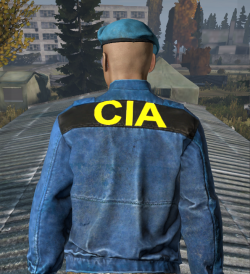
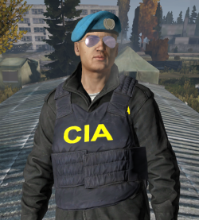
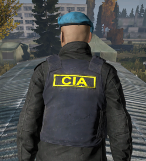
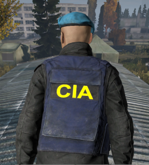
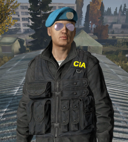
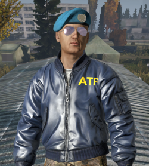
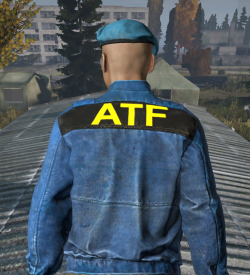

# ItsATreeeClothing

## FBI Assets

### Bomber Jacket - Blue

### Jumpsuit Jacket - Blue

### M65 Jacket - Black

### Police Vest (Stab Vest) - Blue

### Press Vest - Blue

### Tactical Vest - Black

### Tactical Vest - Olive

## CIA Assets

### Bomber Jacket - Blue

### Jumpsuit Jacket - Blue

### M65 Jacket - Black

### Police Vest (Stab Vest) - Blue

### Press Vest - Blue

### Tactical Vest - Black

### Tactical Vest - Olive

## ATF Assets

### Bomber Jacket - Blue

### Jumpsuit Jacket - Blue

### M65 Jacket - Black

### Police Vest (Stab Vest) - Blue

### Press Vest - Blue

### Tactical Vest - Black

### Tactical Vest - Olive

## Making Your Own Texture Mod

This repository holds the basic pieces needed to create a newly textured item in DayZ using standard game assets. 

Step 1. Find the asset you want to modify from the unpacked game assets. Use [DayZ Tools on Steam](https://community.bistudio.com/wiki/DayZ:Modding_Basics#Setup) Step #2 only. Default locations to find assets `C:\Users\[Your User Profile]\Documents\DayZ Projects\DZ`

Step 2. Save a copy of the file as a .png. We now can use paint or any other graphics tool to view.

Step 3. Modify the .png as you see fit. I use [Paint.NET](https://www.getpaint.net/) because it is free and open source.

Step 4. Use Texture View on Dayz Tools to save the modified .png as a .paa. `Click and Drag the .png into Texture View, Save As .paa`

Complete - You now have a file that can be read by DayZ that was modified by you! Simple. Go to [ItsATreeeDayZWorkshopMods](https://github.com/Treee/ItsATreeeDayZWorkshopMods) to learn how to use this custom .paa to make your own mod.

- ***.paa** - This is the texture file read by the game. You can aquire it by downloading the DayZ Tools from Steam and unpacking the game assets.
- ***.pdn** - This is a [Paint.NET](https://www.getpaint.net/) file. A free tool that mimics paid tools such as Photoshop. The Layering and Effects along with open source plugins make it an easy tool for anyone to use. PDN's can be converted to PSD's.
- ***.png** - This is a PNG file. This contains the current texture source that is used to convert into .paa files using the DayZ Tools.