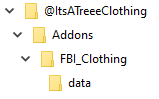
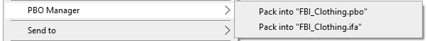
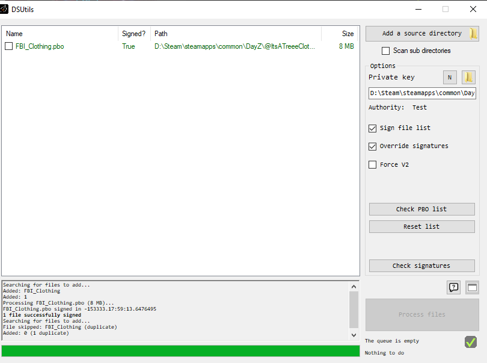
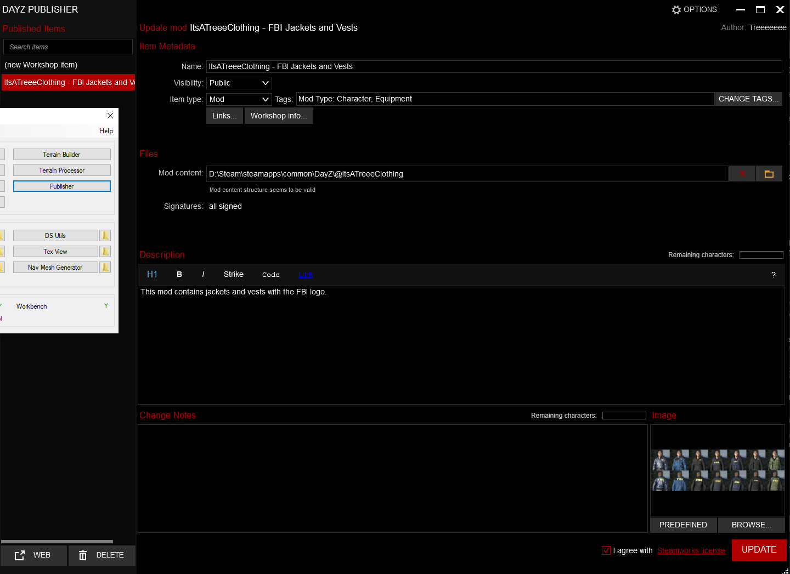

# ItsATreeeClothingWorkshopMod

## Useful Tools
[Eliteness/DePbo/DeOgg](https://mikero.bytex.digital/Downloads)

## Anatomy of A Texture Mod

The structure of the mods is important otherwise they will not load on server start up.



Main Folder   - Name is how you identify between different workshop mods.  
Addons Folder - Required in order to load the mod on server startup.
PBO Folder    - Name is how you identify between different PBO objects. Holds the data folder and `$PREFIX$`, `$PRODUCT$`, and `config.cpp` files.  
data Folder   - Contains the custom .paa files you modified

## The Config Files

$PREFIX$ - This is the name of the prefix that will be used for your mod. `Make sure it matches the Main Folder name.`  
$PRODUCT$ - Irrelevant for this exercise.  
config.cpp - This contains all of the configuration for adding new objects to the game.

## Creating the Config.cpp File

The easiest way to creat your own **config.cpp** file is to use and existing one as a template. You can find the existing configs for default assets here `C:\Users\[Your User Profile]\Documents\DayZ Projects\DZ`. This folder contains all the different categories of items that can be modified in the base game. For the jackets I used this path `C:\Users\[Your User Profile]\Documents\DayZ Projects\DZ\characters\tops\config.cpp.` There are different config.cpp's for each item type. Make sure to choose the correct one.  

You can use [Notepad++](https://notepad-plus-plus.org/downloads/) or [VsCode](https://code.visualstudio.com/) to view the file contents. Save a copy of this file in the PBO folder you created above. Open the copy and get ready to start modifying. Here are the important parts we need to make sure are present:

``` cpp
class CfgPatches
{
	class DZ_Characters_Tops
	{
		units[]=
		{
			"Shirt_CheckRed",
			"Hoodie_Blue",
			"Hoodie_Black",
			"Hoodie_Brown",
			"Hoodie_Green",
			"Hoodie_Grey",
			"Hoodie_Red",
			"MaleTorso",
			"FemaleTorso"
		};
		weapons[]={};
		requiredVersion=0.1;
		requiredAddons[]=
		{
			"DZ_Characters"
		};
	};
};
class CfgVehicles 
{
  class BomberJacket_ColorBase;
  class ItsaTreee_FBI_BomberJacket_Blue: BomberJacket_ColorBase
  {
    scope=2;
    hiddenSelectionsTextures[]=
    {
      "FBI_Clothing\data\bomberjacket_blue_co.paa",
      "FBI_Clothing\data\bomberjacket_blue_co.paa",
      "FBI_Clothing\data\bomberjacket_blue_co.paa"
    };
  };
};
```

Find the item in the default config.cpp, copy the whole scope, from { <- to -> }, and modify the class name to something unique. The filepath needs to be relative to the **Addons** folder.

## How to Make Your Own PBO

[Create a Custom .paa file](https://github.com/Treee/ItsATreeeDayZWorkshopMods/tree/master/ItsATreeeModSource)

Step 1. Download and Install [PBO Manager](https://www.armaholic.com/page.php?id=16369)  

Step 2. Right click the PBO folder you created above. Pack into PBO.  
  

Step 3. We need to sign the PBO now in order for the game to recognize the contents are valid. (Security Step). Open **DSUtils** in DayZ Tools.  
  

Step 4. Add the Source Directory. This will be the **Addons** folder. Process Files.  
`Generate a new private key if needed. Name it whatever you want.`

Complete - You now have a signed PBO file.

## Testing

Add the mod to your startup script by modifying the `"-mod=@DeerIsle;@ItsATreeeClothing"` command line property to include your mod.

`If the mod is syntactically correct, the server will start with no issues.`

Once inside the game, search for your item and verify it exists within the game and does not cause issue.

## Publish To Workshop

Use the Publish Tool in DayZ Tools. Fill out the information required and Publish!

