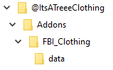
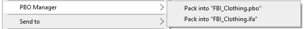
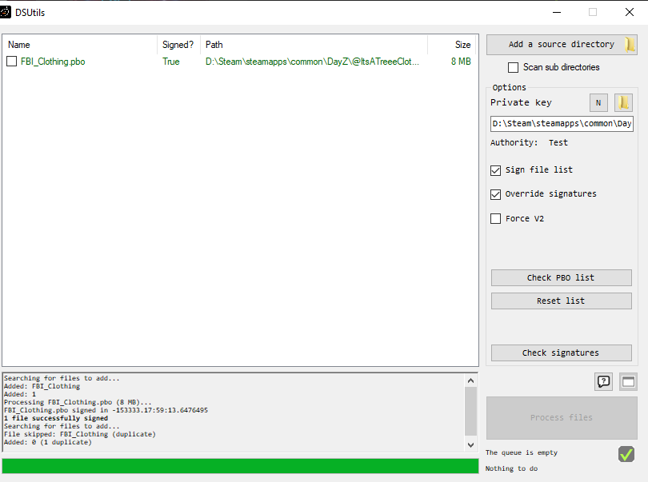

# ItsATreeeClothingWorkshopMod

## Anatomy of A Texture Mod

The structure of the mods is important otherwise they will not load on server start up.

Main Folder   - Name is how you identify between different workshop mods.  
Addons Folder - Required in order to load the mod on server startup.
PBO Folder    - Name is how you identify between different PBO objects. Holds the data folder and `$PREFIX$`, `$PRODUCT$`, and `config.cpp` files.  
data Folder   - Contains the custom .paa files you modified

## The Config Files

$PREFIX$ - This is the name of the prefix that will be used for your mod. `Make sure it matches the Main Folder name.`  
$PRODUCT$ - Irrelevant for this exercise.  
config.cpp - This contains all of the configuration for adding new objects to the game.

## Creating the Config.cpp File

## How to Make Your Own PBO

Step 1. Download and Install [PBO Manager](https://www.armaholic.com/page.php?id=16369)  

Step 2. Right click the PBO folder you created above. Pack into PBO.  
  

Step 3. We need to sign the PBO now in order for the game to recognize the contents are valid. (Security Step). Open **DSUtils** in DayZ Tools.  
  

Step 4. Add the Source Directory. This will be the **Addons** folder. Process Files.  
`Generate a new private key if needed. Name it whatever you want.`

Complete - You now have a signed PBO file.

## Testing

Add the mod to your startup script by modifying the `"-mod=@DeerIsle;@ItsATreeeClothing"` command line property to include your mod.

`If the mod is syntactically correct, the server will start with no issues.`

Once inside the game, search for your item and verify it exists within the game and does not cause issue.